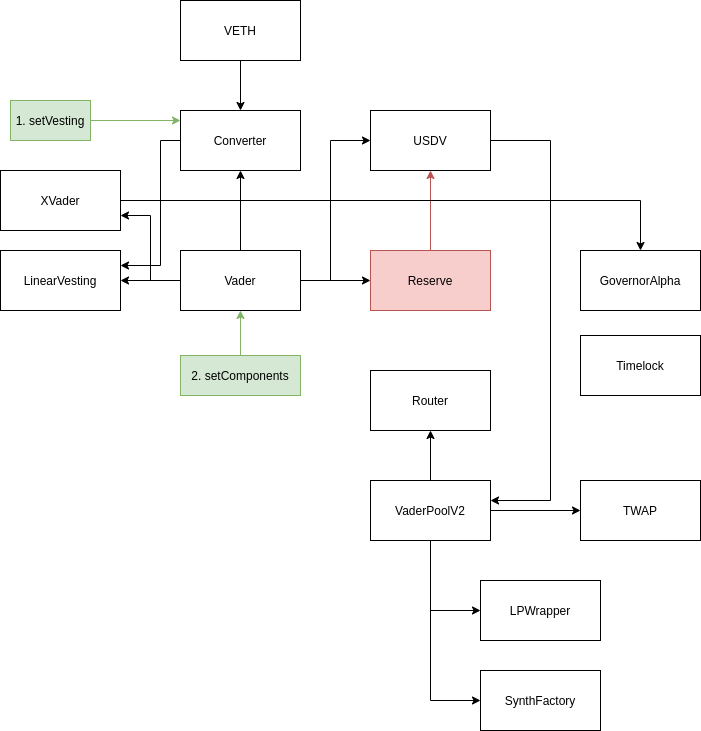

# vader-protocol-v2



## Setup

```shell
npm i
# put your wallet seed here
touch .secret
# put your environment variables here
cp .env.sample .env
```

## Test

```shell
npx ganache-cli
npx truffle test

# prettier
npm run lint
# solhint
npm run solhint
```

## Deploy

```shell
# clean build
npm run compile
# deploy (run migration script from x to y)
npx truffle migrate -f x --to y --network kovan
# verify contract
npx truffle run verify MyContract --network kovan
```

## Networks & Addresses

### Mainnet

-   Vether: 0x4Ba6dDd7b89ed838FEd25d208D4f644106E34279
-   Vader: 0x2602278EE1882889B946eb11DC0E810075650983
-   Converter: 0x6D4a43Ee4770a2Bab97460d3a3B783641D85d108
-   LinearVesting: 0xb3C600C04AaF603b0f422b73Db244216C2e491f6

### Kovan

-   Vether: 0x87D96b9f386d70C72fD7DBcE5a3d2a7D3321446d
-   Vader: 0xcCb3AeF7Baa506e2D05193e38e88459F68AC1a8F
-   Converter: 0x8A313Fa0cb3ed92bE4Cae3a4deF7C32c78181E09
-   LinearVesting: 0xDaA4B82D5Bdd315a3191B080E26ff7A88eb8034E
-   USDV: 0xF5783253A21E5E740908CEdB800183b70A004479
-   UnlockValidator: 0x0c897109F807dB4dFbA87a776747F352f2Ef4A94
